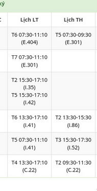

# Timetable scanner  

This app can scan your timetable with OCR, manually create time ranges, and generate calendar. 
Usage mainly for checking time overlap 

# Features 

- Manually create time blocks, and groups, for e.g: Study Math time block,...  
- Create calendar for crafted time blocks  
- Automatically create time blocks from given image with OCR. 
  - Split into separate blocks feature: times of the same line are grouped into the same blocks
  > If disabled, all time will be contain in a single same block

### Future 

- Export to Google Calendar (.ICS) 
- Customizable timetable format 

# Run from source 

```js
git clone https://github.com.khuongduy354/timetable-scanner
cd timetable-scanner  
npm i  
npm run dev 
// check package.json for more commands 
```

# Notes 

- If scans miss data, check the hightlighted printed text below the OCR, to manually add in missing time ranges 
- Check console on browsers (F12) for more infos 
- Supported format is as follow: 

Dates =  T + number (for e.g Monday = T2)  
Times (24h format)= hour:minute-hour:minute (for e.g 7:30-11:30) 


